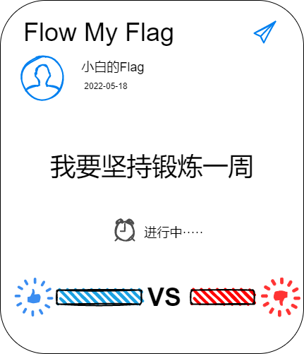

# fmf
Flow My Flag--a Taro3 demo, it is a complete project (frontEnd,backEnd,dataBase .etc)
 
## Assets

## Function

* flow one's flag 
* support or oppose
* announce one flag
* change flag's status
* share the flag 

## Technology Architecture
1. FrontEnd

   * VUE 3.x
   * nutui-taro

2. BackEnd
   
   * nest.js
   * prisma

3. DataBase
   
   * MySQL

## UserStory

1. get user's information from Wechat API when open min-program
2. announce a flag with a modal dialog
3. share a flag to friend or group of wechat
4. support or oppose a flag from other's sharing flag (sum the click event and prevent sb from repeating click)
5. display the flag's status (going, success, fail)
6. change the flag's status (success, fail)